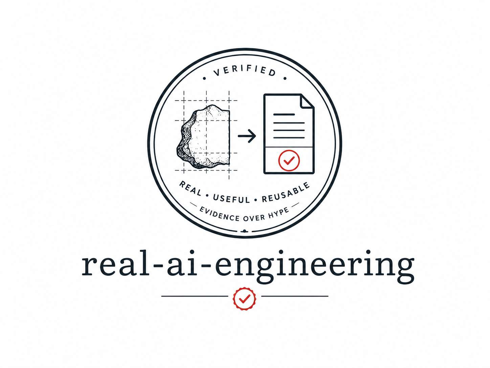

# real-ai-engineering

<p align="center">
  
</p>

从真实 AI 开发问题里沉淀出来的可复用工程资产：Skills、Adapters、Scripts、Cases。

> **Problem first, artifact second** —— 没有真实问题，不产生资产；没有真实验证，不包装成熟。

## 现在有什么

| 资产 | 类型 | 它解决的问题 |
|---|---|---|
| [dev-loop](solutions/dev-loop/) | Skill | 多 Agent 开发漂移、自我审批、无限互审 |
| [computer-management](solutions/computer-management/) | Skill + 模板 | 安全整理 Windows 开发盘，不弄坏应用/环境/数据 |
| [dsh](adapters/dsh/) | Adapter | dev-loop 在 DSH 上的 runtime 硬保证 |
| [acceptance-drift](cases/acceptance-drift/) | Case | 真实事故：Planner 把 3 条验收编成 4 条 |

## 准入原则（三条）

1. **Problem first**：触发词是「这问题怎么第三次遇到了」，不是「今天做个什么 Skill」。第三次数的是**跨上下文**（不同项目 / 不同 Harness 各出现一次），不是同一个 bug 撞三次。
2. **成熟度阶梯**（每级都有死路）：
   `直接解决 → experiments/ → incubating → stable → 才升级 Plugin/Tool`
   没有跨项目复现 → 不升 stable。
3. **元信息契约**（每个资产必须回答，缺一不可）：
   `Problem / Solution / Use when / Don't use when / Evidence / Compatibility / Known limitations`
   其中 `Use when`、`Don't use when`、`Known limitations` **必填**——专治「为了显通用加三层 abstraction」。

## 结构

```
solutions/   ← Skills 与成套方案（按问题域，不按技术形态）
adapters/    ← 把 portable policy 落到某个 Harness 的 runtime 实现
cases/       ← 真实失败 + 真实修复的回归样本
```

## 参与

发现问题先开 Issue。贡献新资产先过上面三道闸（真实问题 / 成熟度 / 元信息）。

**允许小众**：一个只解决「Windows + PowerShell + Codex」痛点的资产照样欢迎，只要老实写清 `Not intended for`。

## License

MIT
