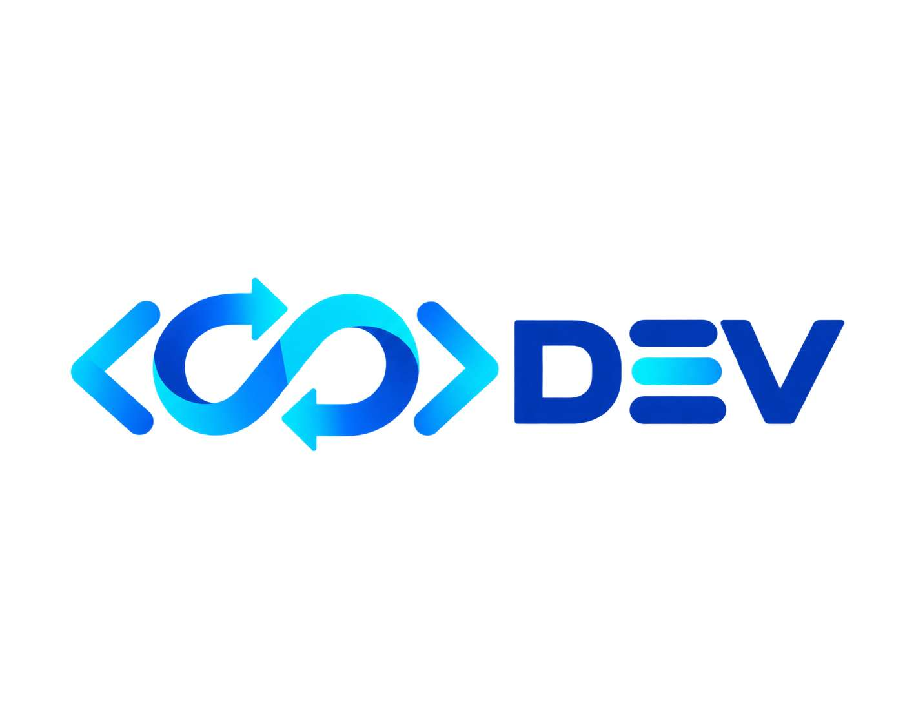

# dev-loop

  

面向真实开发迭代的 AI 开发循环。

- **Problem**：多 Agent 协作反复出现「自我审批」「聊天上下文越滚越偏」「无限互审打补丁」——因为把角色写死，却没写清迭代规律。
- **Solution**：宪法 10 条 + Playbook + 状态机（DESIGN→PLAN→IMPLEMENT→VERIFY→TRIAL→DONE）+ Failure Routing（两次同类失败强制 RETHINK）+ 4 种工件 + 4 个人类门禁。
- **Use when**：需要规划 / 实现 / 验证 / 试用 / 迭代的软件开发任务；复杂任务、高风险变更、需要独立审查的场景。
- **Don't use when**：一次性小改动（直接做，别上流程）；不需要跨角色交接的单人任务。
- **Evidence**：e2e 仿真全链路走通（claude→DeepSeek，零 Codex 额度）；AC contract 从真实 3→4 漂移事故长出；脚本失败路径冒烟 6/5/3/3；dev/global 字节一致。
- **Compatibility**：DSH（runtime adapter + 全局发现实测）；Codex（静态兼容，runtime 待验）；OpenCode（待验）。
- **Known limitations**：DSH 显式调用/加载待真实项目验证；Codex runtime discovery/invocation 待额度；OpenCode 未装未验。

## 布局

- `SKILL.md` — 宪法 + Playbook（可移植 policy）
- `templates/` — RESULT / EXPERT_PACKET / CURRENT_STATE
- `references/triad-engineering-closure.md` — 高风险 RC/发布/安全审计完整版（按需升级启用）

Runtime 硬保证见 `adapters/dsh/`。
